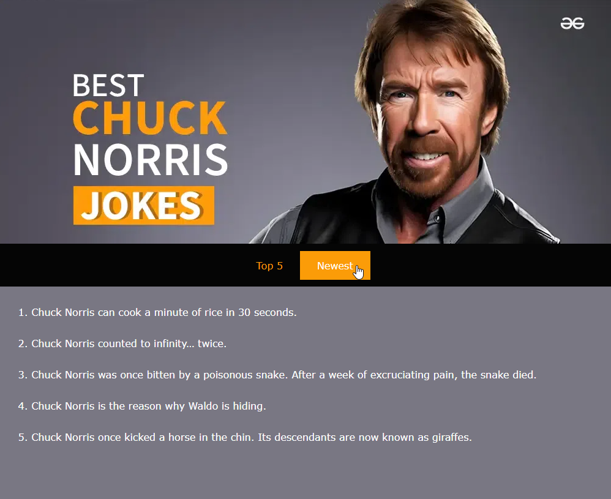

**PE2: GIT taak 2**

Verwerk de volgende vereisten zoals in de "Project Vereisten" sessie.

- Clone deze repository 
- Maak voor elke vereiste een commit in je eigen (lokale) repository.
- Voor elke commit vermeld je het vernoemde ID (HEAD-01, enz.) in de commit message.
- Push alle commits naar deze repository

Gevraagd: Bouw de volgende webpagina zo goed mogelijk na:

Requirements:

| ID      | Onderwerp       | Beschrijving                                                                                                                                                                                                                                                                                                  |
|---------|-----------------|---------------------------------------------------------------------------------------------------------------------------------------------------------------------------------------------------------------------------------------------------------------------------------------------------------------|
| BOOT-01 | Algemene opmaak | Gebruik de wildcard selector om de witruimte binnen & buiten elk element op 0 te zetten. Geef het body element een breedte van 1000px en zorg dat de witruimte buiten het element links en rechts automatisch berekend wordt.                                                                                 |
| HEAD-01 | Header          | Maak een header structuur element met als achtergrondafbeelding chuck.webp. Zorg dat het header element 400px hoog is.                                                                                                                                                                                        |
| NAV-01  | Navigatie       | Maak een navigatie structuur element, met achtergrondkleur #050505, met daarin een ongeordende lijst met 2 items. Probeer deze naast elkaar en horizontaal gecentreerd te plaatsen. *Tip: CSS Flexbox*                                                                                                        |
| LINK-01 | Hyperlinks      | Plaats binnen elk item van de navigatielijst een dummy link. Geef deze een tekstkleur #fb9c08 en zorg dat deze niet onderlijnd worden. Wijzig de achtergrondkleur van de hyperlink wanneer de gebruiker hier met de muis over beweegt. Gebruik de achtergrondkleur #fb9c08 en maak ook de tekstkleur wit. |
| MAIN-01 | Inhoud          | Voeg je 5 beste Chuck Norris grapjes toe door gebruik te maken van een geordende lijst. Alle tekst in de main heeft een witte kleur en de achtergrond is rgb(121,119,131)                                                                                                                                     |

